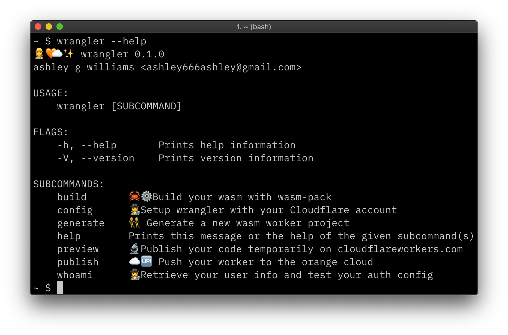

# Build an Application

Welcome to Cloudflare Workers! This tutorial series will bring you from no experience with Workers, to writing and deploying a full application to Cloudflare's edge network.

Cloudflare Workers is a platform for building and deploying serverless applications to a global cloud network. If you’re interested in how the platform works, check out the [Reference]() section of the documentation!

This quick start guide will get you up and running with Wrangler, our command-line tool for building, previewing, and deploying Cloudflare Workers. As you continue to build and deploy to Cloudflare Workers, you’ll make use of all of Wrangler’s features to manage your application, so we recommend going through this brief guide before moving into the full tutorial!

## Prerequisities

All of the tutorials in the Workers documentation use [Wrangler][2], our open-source command-line tool for managing Cloudflare Workers projects. To begin, you’ll need to install Wrangler on your machine. We publish binaries for most platforms as part of our release process: to install Wrangler on your machine, follow the instructions on our [Install Wrangler][3] page.

To confirm that Wrangler has successfully installed on your machine, try running `wrangler —help` on the command-line. You should see output like the below screenshot:



To publish Cloudflare Workers projects and serve them from our global edge network, you'll need to create a Cloudflare account (TODO: is this true for zoneless workers? different account?).

Once you've signed up (or if you already have an account), you'll need to find a few important keys in Cloudflare's Dashboard UI: your **Account ID**, Zone ID, and your **Global API key** – Wrangler will use these to manage uploading and publishing your Workers.

**To find your Account and Zone IDs, do the following:**

1. Login to Cloudflare with the account you'd like to use for deploying Cloudflare Workers
2. Select the "Home" button on the top navigation bar.
3. Click on a site that you currently host with Cloudflare – this should bring you to the "Overview" tab on the Dashboard.
4. Scroll down and look for the section in the sidebar titled "API": your Account ID and Zone ID will be displayed, as well as the option to "Click to copy" under each key.

**To find your API key, do the following:**

1. Click on the Profile icon at the top-right of the screen, and select "My Profile". Your account email should also be listed underneath the "My Profile" text.
2. On the "My Profile" page, scroll down to "API Keys", and find "Global API Key".
3. Enter your password, and click "View" to see your Global API Key.


**Treat your Global API Key like a password!** We'll configure Wrangler to use this key, but by design, Wrangler does not keep this API key in version control, or inside of your code.

With these keys, we can use Wrangler to set up our default credentials for deploying to Cloudflare Workers, via the `config` subcommand:

`wrangler config <email> <global_api_key>`

## Scaffold a Project

We've tried to make it as easy as possible for new and returning users alike to get up and running with Workers, by including support for templates in Wrangler. Wrangler's `generate` subcommand allows you to create new projects based on existing templates. We maintain a great list of templates in our [Template Gallery](/gallery), designed to help you get started quickly with Workers based on what you need in your project. For now, we'll use one of our basic templates, which includes support for building, deploying, and running JavaScript code on our edge servers.

Let's generate our first Wrangler project:

```
wrangler generate my-worker https://github.com/cloudflare/worker-template
```


TODO: "Generating a new *rustwasm*"

Notice that Wrangler also supports the inclusion of a URL in this command, such as `wrangler generate https://github.com/cloudflare/template`. For now, we'll use Wrangler's default template, but as you become more familiar with Wrangler, you may want to create your own templates, or use something from the [Template Gallery](/gallery).

> 💡 Protip: If you're ever unsure what a Wrangler subcommand does, like `wrangler generate`, try adding `--help` to the end of the command: for instance, `wrangler generate --help`. This will show you the available *arguments*, *flags*, and usage instructions for that specific subcommand.

## Build and Preview your Project

First, we'll navigate into the new project directory generated for us by Wrangler, and look at the list of files created:

```
cd my-worker
ls
```


In the longer tutorial, we'll look more closely at `worker.js`: this is the actual code that you'll deploy to Workers. In the meantime, let's use two more Wrangler commands to build our project, and preview it:

```
wrangler build
wrangler preview
```

Wrangler's `build` command will install the necessary dependencies for your project, and compile it to make it ready for deployment. The `build` command will also notify you of any warnings in your project before deployment, such as missing fields, configuration errors, and more. `TODO: I hate saying "and more", this is very vague`

The `preview` command will take your built Worker project and upload it to a unique URL at [cloudflareworkers.com](https://cloudflareworkers.com). This means that you can actually test your project with our Workers runtime, and optionally, you can share this URL so that other users can test your Worker!


(TODO: JS preview currently doesn't work, should be updated when JS support lands in Wrangler)

## Configure your Project

Before we can deploy our Worker to production, we need to fill in a few fields inside of `wrangler.toml`. This file will contain the information Wrangler needs to connect to the Cloudflare Workers API, and deploy your code.

Earlier in the quick start guide, we logged into the Cloudflare Dashboard UI to get your **Account ID** and **Zone ID**. In `wrangler.toml`, fill in the corresponding `account_id` and `zone_id` with the values found in your dashboard. The **name** field in this config file should have a default value already filled in – feel free to change it, if you'd like.

Last but not least, we need to set a **route** for your Worker: where your Worker will be hosted, and accessible by your users. The route field here is a *pattern*: if we chose the route `wasm-worker.signalnerve.com`, the Worker would _only_ run on that exact subdomain, at the *root* path. If we changed the route to `wasm-worker.signalnerve.com/*` (using the `*` or *wildcard* symbol), the Worker would then run on any path on that subdomain, for instance, `wasm-worker.signalnerve.com/test`, or even `wasm-worker.signalnerve.com/test/123`.

When thinking about routes, you should consider the URLs that you want your Worker to run on – for instance, if you have a full application, you probably want to choose something like `wasm-worker.signalnerve.com/*`, or if you just want to deploy a single function to an existing site, you should pick a more specific route, like `wasm-worker.signalnerve.com/function`. In our case, we'll stick with the *wildcard* route: `wasm-worker.signalnerve.com/*`.

## Publish your Project

With our project configured, it's time to publish our Worker! Wrangler has a built-in command for uploading your Worker script, generating the route that corresponds to your `wrangler.toml` file, and wiring them together. If that sounds complicated, don't worry – we've made it really easy:

```
wrangler publish
```


Your Worker will be uploaded and deployed to the route you specified in your config file. To ensure that everything deployed correctly, go to the URL specified at the end of the publishing process – you should see your Worker running as expected!


TODO I have multiscript, and this whole section assumes zone workers: will need to redo this with zoneless workers and probably rework the routing copy as we update Wrangler to support that.

## Learn More

This is just the beginning of what you can do with Cloudflare Workers. If you'd like to dive deeper into building a full application with Workers, check out the full-length tutorial below!

- [Building a Slack bot with Cloudflare Workers][4]

[2]:	https://github.com/cloudflare/wrangler
[3]:	TODO
[4]:	./tutorials/building-a-slack-bot.md
