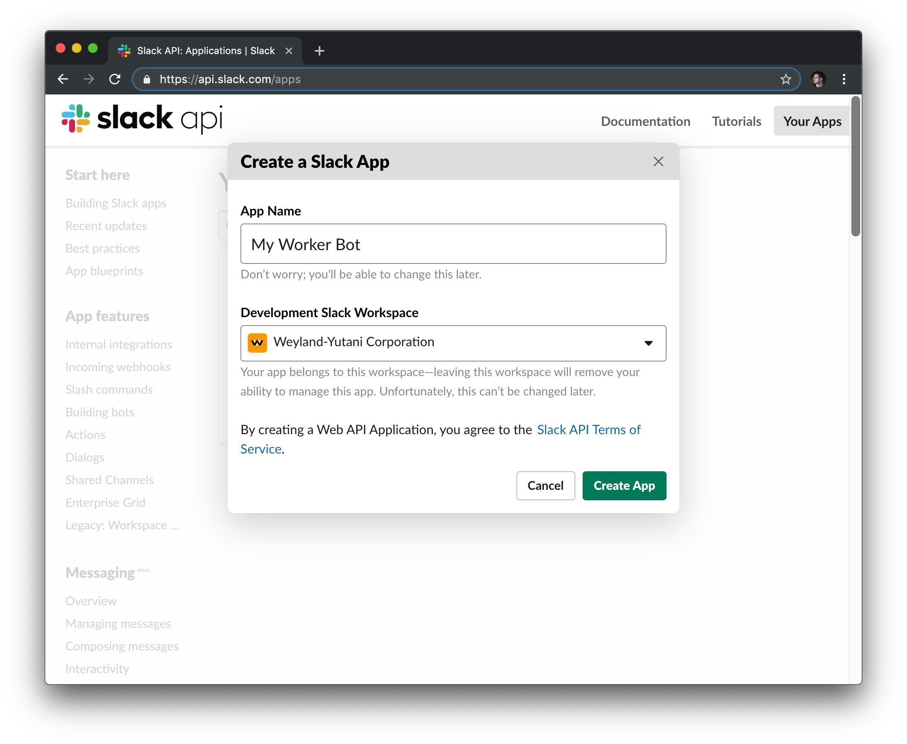
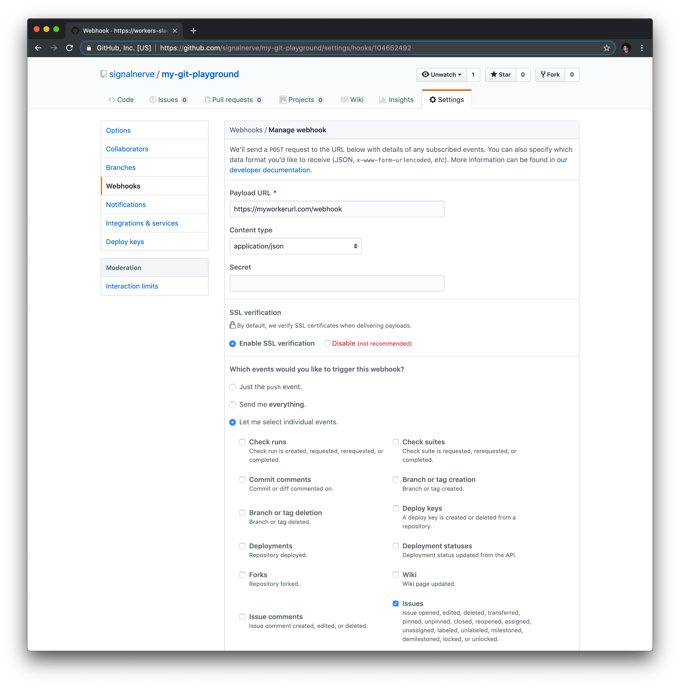

# Build a Slack bot

In this tutorial, we'll build a [Slack](https://slackhq.com) bot using [Cloudflare Workers](https://workers.cloudflare.com). Our bot will make use of GitHub webhooks to send messages to a Slack channel when issues are updated or created, and allow users to write a command to look up GitHub issues from inside Slack.

<video loop muted="true">
  <source src="../media/slash-commands.webm" type="video/webm">
  <source src="../media/slash-commands.mp4" type="video/mp4">
  Your browser doesn't support HTML5 video in WebM or MP4.
</video>

This tutorial makes use of [Wrangler](https://github.com/cloudflare/wrangler), our command-line tool for generating, building, and publishing projects on the Cloudflare Workers platform. If you haven't used Wrangler, we recommend checking out the [quick-start guide](../), which will get you set up with Wrangler, and familiar with the basic commands.

This tutorial is recommended for people who are familiar with writing web applications. If you've ever built an application with tools like [Node](https://nodejs.org) and [Express](https://expressjs.com), this project will feel very familiar to you. That being said, if you're new to writing web apps, we think that Workers is a super easy way to focus on writing code, and actually shipping projects: maybe you've wanted to build something like a Slack bot in the past, but things like deployment and configuration have always seemed a little scary. In either case, welcome! We're thrilled to have you here!

One more thing before we start the tutorial: if you'd like to see the code, or how the bot works in an actual Slack channel, we've made the final version of the codebase [available on GitHub] TODO. From there, you can add your own Slack API keys, and deploy it to your own Slack channels for testing.

## Prerequisites

To publish your Worker to Cloudflare, and configure it with a Slack channel, you'll need a few things:

- A Cloudflare account, and access to your Cloudflare API keys
- A Slack channel, and the ability to create and manage Slack applications

- A Wrangler installation running locally on your machine, and access to the command-line

If you don't have those things quite yet, don't worry! We'll walk through each of them and make sure we're ready to go, before we start creating our application.

### Setting up your Cloudflare account

To publish Cloudflare Workers projects and serve them from our global edge network, you'll need to create a Cloudflare account (TODO: is this true for zoneless workers? different account?).

Once you've signed up (or if you already have an account), you'll need to find a few important keys in Cloudflare's Dashboard UI: your **Account ID**, **Zone ID**, and your **Global API key** – Wrangler will use these to manage uploading and publishing your Workers.

**To find your Account and Zone IDs, do the following:**

1. Login to Cloudflare with the account you'd like to use for deploying Cloudflare Workers
2. Select the "Home" button on the top navigation bar.
3. Click on a site that you currently host with Cloudflare – this should bring you to the "Overview" tab on the Dashboard.
4. Scroll down and look for the section in the sidebar titled "API": your Account ID and Zone ID will be displayed, as well as the option to "Click to copy" under each key.

**To find your API key, do the following:**

1. Click on the Profile icon at the top-right of the screen, and select "My Profile". Your account email should also be listed underneath the "My Profile" text.
2. On the "My Profile" page, scroll down to "API Keys", and find "Global API Key".
3. Enter your password, and click "View" to see your Global API Key.


**Treat your Global API Key like a password!** We'll configure Wrangler to use this key, but by design, Wrangler does not keep this API key in version control, or inside of your code.

TODO: a user should know what their subdomain is for the Slack bot before continuing into the Slack config section. With zoneless/zoned workers, how can we help users understand what their bot URL is?

###  Configure a Slack application

To post messages from our Cloudflare Worker into a Slack channel, you'll need to create an application in Slack's UI. To do this, go to Slack's API section, at [api.slack.com/apps](<https://api.slack.com/apps>), and select "Create New App".



Slack applications have a ton of features, but we'll make use of two of them, *Incoming Webhooks*, and *Slash Commands*, to build our Worker-powered Slack bot.

#### Incoming Webhook

*Incoming Webhooks* are URLs that you can use to send messages to your Slack channels. Our incoming webhook will be paired with GitHub's webhook support to send messages to a Slack channel whenever there is updates to issues in a given repository. We'll look at the code in more detail as we build our Worker, but for now, let's create the Slack webhook!

On the sidebar, select *Incoming Webhooks*, and in the section "Webhook URLs for your Workspace", select "Add New Webhook to Workspace". On the following screen, select the channel that you want your webhook to send messages to: you can select a room, like #general or #code, or be DMed directly by our Slack bot when the webhook is called. Authorizing the new webhook URL should bring you back to the *Incoming Webhooks* page, where you'll be able to view your new webhook URL. We'll add this into our Workers code later: for now, we'll move onto adding the second component of our Slack bot, a *Slash Command*.


#### Slash Command

A *Slash Command* in Slack is a custom-configured command that can be attached to a URL request: for instance, if we configured `/weather <zip>`, Slack would make an HTTP POST request to a configured URL, passing the text `<zip>` to get the weather for a specified zip code. In our application, we'll use the `/issue` command to look up GitHub issues using the [GitHub API](https://developer.github.com). Typing `/issue cloudflare/wrangler#1` will send an HTTP POST request to our Cloudflare Worker, sending the text `cloudflare/wrangler#1`, which we'll use to find the [relevant GitHub issue](https://github.com/cloudflare/wrangler/issues/1).

On the sidebar, select *Slash Commands*, and create your first slash command. For our example, we'll use the command `/issue`. The request URL should be the `/lookup` path on your Worker URL: for instance, if your Worker will be hosted at `https://myworkerurl.com`, the Request URL should be `https://myworkerurl.com/lookup`.


### Configure your GitHub Webhooks

Our Cloudflare Workers application will be able to handle incoming requests from Slack, but it should also be able to receive events directly from GitHub: if an issue is created or updated, we can make use of GitHub webhooks to send that event to our Workers application, and post a corresponding message in Slack.

To configure a webhook, you'll need access to a repository on GitHub, and permissions to add and manage webhooks via the "Webhooks" section inside your repository's "Settings" in the GitHub UI. If you have a repository like `https://github.com/user/repo`, you can access the "Webhooks" page directly at `https://github.com/user/repo/settings/hooks`.

Create a new webhook, and set the Payload URL to the `/webhook` path on your Worker URL: for instance, if your Worker will be hosted at `https://myworkerurl.com`, the Payload URL should be `https://myworkerurl.com/webhook`. The *Content type* for your payload can either be a URL-encoded payload (`application/x-www-form-urlencoded`), or JSON (`application/json`): to make parsing the payload sent to our application, we'll select JSON.

GitHub webhooks allow you to specify _which_ events you'd like to have sent to your webhook: by default, the webhook will send *push* events from your repository. Instead of that, select "Let me select individual events". There are a ton of different event _types_ that can be enabled for your webhook, but as you might guess, we'll focus on the *Issues* event type. Selecting *Issues* will send every issue-related event to your webhook, including when issues are opened, edited, deleted, and more. If you'd like to expand your Slack bot application in the future, you can select more of these events after the tutorial: for now, our Slack bot is exclusively focused on issues, so just select *Issues* and create your webhook.



When your webhook is created, it will attempt to send a test payload to your application. Since it isn't actually deployed yet, we'll leave the configuration as-is right now, and then come back to our repo to actually create, edit, and close some issues to ensure that things work once our application is deployed.

## Generate

Cloudflare's command-line tool for managing Worker projects, Wrangler, has great support for templates – pre-built collections of code that make it easy to get started writing Workers. We'll make use of the default JavaScript template to start building our project.

In the command line, let's generate our Worker project, using Wrangler's [worker-template](<https://github.com/cloudflare/worker-template>), and passing the project name "slack-bot":

```
wrangler generate slack-bot https://github.com/cloudflare/worker-template
cd slack-bot
```

Wrangler templates are just Git repositories, so if you want to create your own templates, or use one from our [Template Gallery], there's a ton of options to help you get started. 

Cloudflare's `worker-template` includes support for building and deploying JavaScript-based projects. Inside of our new `slack-bot` directory, `index.js` represents the entry-point to our Cloudflare Workers application.

All Cloudflare Workers applications start by listening for `fetch` events, which are fired when a client makes a request to a Workers route. When that request occurs, we can construct responses and return them to the user. This request/response pattern should be familiar to web application developers who have worked with tools like Express.js, but if it doesn't feel familiar, don't worry! This tutorial will walk you through understanding how the request/response pattern works, and how we can use it to build fully-featured applications.

```javascript
addEventListener("fetch", event => {
  event.respondWith(handleRequest(event.request))
})

/**
 * Fetch and log a request
 * @param {Request} request
 */
async function handleRequest(request) {
  return new Response("Hello worker!", {status: 200})
}
```

In our default `index.js` file, we can see that request/response pattern in action. The `handleRequest` constructs a new `Response` with the body text "Hello worker", as well as an explicit status code of 200. When a `fetch` event comes into the worker, the script uses `event.respondWith` to return that new response back to the client. This means that your Cloudflare Worker script will serve new responses directly from Cloudflare's edge servers: instead of continuing to the origin, where a standard server would accept requests, and return responses, Cloudflare Workers allows you to respond quickly and efficiently by constructing responses directly on the edge.

## Build

To build our Slack bot on Cloudflare Workers, we'll build up our application file-by-file, separating different parts of the application and using modern JS tooling like ES modules, NPM packages, and [async/await](https://developer.mozilla.org/en-US/docs/Web/JavaScript/Reference/Statements/async_function) functions to put together our application.

To begin, we'll define our routes. For larger Cloudflare Workers applications, the addition of a router library can make it incredibly easy to match incoming requests to different function handlers in your codebase.

Our application has two routes/function handlers that we need to define:

1. The `lookup` function will take requests from Slack (sent when a user uses the `/issue` command), and look up the corresponding issue using the GitHub API. This function will be a `GET` request to `/lookup`.
2. The `webhook` function will be called when updates occur rom Slack (sent when a user uses the `/issue` command), and look up the corresponding issue using the GitHub API. This function will be a `GET` request to `/lookup`.

Because routing inside of your Workers application is such a common task, we've published an easy-to-use router that you can drop into your code. This router will allow you to match specific paths to functions in your codebase. Find the router [here] TODO - NPM package?, and save it in your application as `router.js`.

### Handling requests

Inside of `index.js`, we'll import the router, and use it to update our `handleRequest` function:

```javascript
import Router from "./router"

addEventListener("fetch", event => {
  event.respondWith(handleRequest(event.request))
})

async function handleRequest(request) {
  const r = new Router()
  r.post("/lookup", lookup)
  r.post("/webhook", webhook)

  let response = await r.route(request)

  if (!response) {
    response = new Response("Not found", {status: 404})
  }

  return response
}
```

Let's walk through the code so that we understand how it works. First, we'll import the `Router` class from `router.js`. In `handleRequest`, we instantiate a new instance of `Router`, setting to the variable `r`. The `Router` class makes use of a few functions to allow you to quickly and easily set up request handling: the `post` method, as you might expect, takes in a path string, and a function handler, to say "when a client sends an HTTP `POST` to the path `/lookup`, call the `lookup` function".

We have two `POST` routes we want to handle: `/lookup` and `/webhook`. Both of our new routes will point to corresponding functions, `lookup` and `webhook` – we haven't quite set those up, but we'll do that soon!

Once our routes are set up, we need to actually handle the incoming request, which is available under the variable `request`. The `route` function on our router takes in a `request` argument, and returns a `response`. Note that we're able to use great JS features like async/await inside of our Workers application, thanks to Workers' V8 runtime: since `r.route` returns a Promise, we can write `await r.route(request)` to set `response` to the result of the resolved Promise..

If we _don't_ find a matching route (for instance, if someone requests the path `/admin`), we should return a response with a status code of 404. Our `handleRequest` checks to see if `response` is `undefined`, and if it is, it sets `response` to a new `Response` with the body text "Not found", and a status code of 404. 

Finally, we return the `response`, whether it's a match from our router, or a 404, back to the `fetch` event. The result will be *either* a handled API route, or a plain HTTP response.

This request/response pattern makes it really straightforward to understand _how_ requests are routed in your Workers application. We're *almost* done with this file: to complete it, we need to actually define the corresponding function handlers for our routes. In this tutorial, we'll define those handlers in `src/handlers`:

```
mkdir -p src/handlers
touch src/handlers/lookup.js
touch src/handlers/webhook.js
```

With those files created (we'll fill them in soon), let's import them at the top of `index.js`. The final version of our code looks like this:

```javascript
import lookup from "./src/handlers/lookup"
import webhook from "./src/handlers/webhook"
import Router from "./router"

addEventListener("fetch", event => {
  event.respondWith(handleRequest(event.request))
})

async function handleRequest(request) {
  const r = new Router()
  r.post("/lookup", lookup)
  r.post("/webhook", webhook)

  let response = await r.route(request)

  if (!response) {
    response = new Response("Not found", {status: 404})
  }

  return response
}
```

### Creating the "lookup" route

Let's move into `src/handlers/lookup.js` to define our first route handler. The `lookup` handler is a function with one argument, the `request` being passed from our `fetch` event in `index.js`:

```javascript
export default async request => {}
```

To understand how we should design this function, we need to understand how Slack *slash commands* send data to URLs. 

According to the [documentation for Slack slash commands](<https://api.slack.com/slash-commands>), Slack sends an HTTP POST request to your specified URL, with a `application/x-www-form-urlencoded` content type. For instance, if someone were to type `/issue cloudflare/wrangler#1`, we could expect a data payload in the format:

```
token=gIkuvaNzQIHg97ATvDxqgjtO
&team_id=T0001
&team_domain=example
&enterprise_id=E0001
&enterprise_name=Globular%20Construct%20Inc
&channel_id=C2147483705
&channel_name=test
&user_id=U2147483697
&user_name=Steve
&command=/issue
&text=cloudflare/wrangler#1
&response_url=https://hooks.slack.com/commands/1234/5678
&trigger_id=13345224609.738474920.8088930838d88f008e0
```

Given this payload body, we'll need to parse it and get the value of the `text` key. With that `text`, for instance, `cloudflare/wrangler#1`, we can parse that string into known piece of data (`owner`, `repo`, and `issue_number`), and use it to make a request to GitHub's API, to retrieve the issue data.

With Slack slash commands, we can respond to a slash command by returning structured data as the response to the incoming slash command. In our case, we should use the response from GitHub's API to present a formatted version of the GitHub issue, including pieces of data like the title of the issue, who created it, and the date it was created. Slack's new [Block Kit](<https://api.slack.com/block-kit>) framework will allow us to return a detailed message response, by constructing text and image *blocks* with the data from GitHub's API. 

#### Parsing slash commands

To begin, let's parse the incoming data from a Slack message inside of our `lookup` handler. As previously mentioned, the Slack API sends an HTTP POST in URL Encoded format. To parse this, we'll add our first NPM package to our project – a popular query string parser package called [`qs`](<https://github.com/ljharb/qs>):

`npm install --save qs`

In  `src/handlers/lookup.js`, we'll import `qs`, and use it to parse the `request` body, and get the `text` value from it:

```javascript
import qs from "qs"

export default async request => {
  const body = await request.text()
  const params = qs.parse(body)
  const text = params["text"].trim()
}
```

Given a `text` variable, that contains text like `cloudflare/wrangler#1`, we should parse that text, and get the individual parts from it for use with GitHub's API: `owner`, `repo`, and `issue_number`. To do this, we'll create a new file in our application, at `src/utils/github.js`. This file will contain a number of "utility" functions for working with GitHub's API. The first of these will be a string parser, which we'll call `parseGhIssueString`:

```javascript
const ghIssueRegex = /(?<owner>\w*)\/(?<repo>\w*)\#(?<issue_number>\d*)/
export const parseGhIssueString = text => {
  const match = text.match(ghIssueRegex)
  return match ? match.groups : null
}
```

`parseGhIssueString` takes in a `text` input, matches it against `ghIssueRegex`, and if a match is found, returns the `groups` object from that match, making use of the `owner`, `repo`, and `issue_number` capture groups defined in the regex. By exporting this function from `src/utils/github.js`, we can make use of it back in `src/handlers/lookup.js`:

```javascript
import qs from "qs"

import {parseGhIssueString} from "../utils/github"

export default async request => {
  const body = await request.text()
  const params = qs.parse(body)
  const text = params["text"].trim()
  const {owner, repo, issue_number} = parseGhIssueString(text)
}
```

#### Making requests to GitHub's API

With this data, we can actually make our first API lookup to GitHub. Again, we'll make a new function in `src/utils/github.js`, to make a `fetch` request to the GitHub API for the issue data:

```javascript
export const fetchGithubIssue = (owner, repo, issue_number) => {
  const url = `https://api.github.com/repos/${owner}/${repo}/issues/${issue_number}`
  const headers = {"User-Agent": "simple-worker-slack-bot"}
  return fetch(url, {headers})
}
```

Back in `src/handlers/lookup.js`, we can use `fetchGithubIssue` to make a request to GitHub's API, and parse the response:

```javascript
import qs from "qs"

import {fetchGithubIssue, parseGhIssueString} from "../utils/github"

export default async request => {
  const body = await request.text()
  const params = qs.parse(body)
  const text = params["text"].trim()
  const {owner, repo, issue_number} = parseGhIssueString(text)

  const response = await fetchGithubIssue(owner, repo, issue_number)
  const issue = await response.json()
}
```

#### Constructing a Slack message

Once we've gotten a response back from GitHub's API, the final step is to construct a Slack message with the issue data, and return it to the user. The final result will look something like this:


If we break down the above screenshot, we can see four different pieces:

1. The first line (bolded) *links to the issue*, and shows the *issue title*
2. The following lines (including code snippets) are the *issue body*
3. The last line of text shows the *issue status*, the *issue creator* (with a link to the user's GitHub profile), and the *creation date* for the issue
4. The *profile picture of the issue creator*, on the right-hand side

The previously mentioned [Block Kit](<https://api.slack.com/block-kit>) framework will help us take the issue data (in the structure lined out in [GitHub's REST API documentation](<https://developer.github.com/v3/issues/>)) and format it into something like the above screenshot.

Let's create another file, `src/utils/slack.js`, to contain the function `constructGhIssueSlackMessage`, a function for taking issue data, and turning it into a collection of *blocks*: simple JavaScript objects that Slack will use to format the message:

```javascript
export const constructGhIssueSlackMessage = (
  issue,
  issue_string
) => {
  const issue_link = `<${issue.html_url}|${issue_string}>`
  const user_link = `<${issue.user.html_url}|${issue.user.login}>`
  const date = new Date(Date.parse(issue.created_at)).toLocaleDateString()

  const text_lines = [
    `*${issue.title} - ${issue_link}*`,
    issue.body,
    `*${issue.state}* - Created by ${user_link} on ${date}`
  ]
}
```

Slack messages accept a variant of Markdown, which supports bold text via asterisks (`*bolded text*`), and links in the format `<https://yoururl.com|Display Text>`. 

Given that format, we can construct `issue_link`, which takes the `html_url` property from the GitHub API `issue` data (in format `https://github.com/cloudflare/wrangler/issues/1`), and the `issue_string` sent from the Slack slash command, and combines them into a clickable link in the Slack message. 

`user_link` is similar, using `issue.user.html_url` (in the format `https://github.com/signalnerve`, a GitHub user) and the user's GitHub username (`issue.user.login`), to construct a clickable link to the GitHub user. 

Finally, we can parse  `issue.created_at`, an ISO 8601 string, convert it into an instance of a JavaScript `Date`, and turn it into a formatted string, in the format `MM/DD/YY`.

With those variables in place, `text_lines` is an array of each piece of text for our message. The first line is the *issue title* and the *issue link*, the second is the *issue body*, and the final line is the *issue state* (for instance, open or closed), the *user link*, and the *creation date*:

```javascript
export const constructGhIssueSlackMessage = (
  issue,
  issue_string
) => {
  const issue_link = `<${issue.html_url}|${issue_string}>`
  const user_link = `<${issue.user.html_url}|${issue.user.login}>`
  const date = new Date(Date.parse(issue.created_at)).toLocaleDateString()

  const text_lines = [
    `*${issue.title} - ${issue_link}*`,
    issue.body,
    `*${issue.state}* - Created by ${user_link} on ${date}`
  ]
}
```

With all of our text constructed, we can finally construct our Slack message, returning an array of *blocks* for Slack's [Block Kit](<https://api.slack.com/block-kit>). In our case, we only have one block: a *[section](<https://api.slack.com/reference/messaging/blocks#section>)* block with our Markdown text, and an *accessory* image of the user who created the issue. We'll return that single block inside of an array, to complete our `constructGhIssueSlackMessage` function:

```javascript
export const constructGhIssueSlackMessage = (
  issue,
  issue_string
) => {
  const issue_link = `<${issue.html_url}|${issue_string}>`
  const user_link = `<${issue.user.html_url}|${issue.user.login}>`
  const date = new Date(Date.parse(issue.created_at)).toLocaleDateString()

  const text_lines = [
    `*${issue.title} - ${issue_link}*`,
    issue.body,
    `*${issue.state}* - Created by ${user_link} on ${date}`
  ]

  return [
    {
      type: "section",
      text: {
        type: "mrkdwn",
        text: text_lines.join("\n")
      },
      accessory: {
        type: "image",
        image_url: issue.user.avatar_url,
        alt_text: issue.user.login
      }
    }
  ]
}
```

#### Finishing the lookup route

In `src/handlers/lookup.js`, we'll use `constructGhIssueSlackMessage` to construct `blocks`, and return them as a new response when the *slash command* is called:

```javascript
import qs from "qs"

import {fetchGithubIssue, parseGhIssueString} from "../utils/github"
import {constructGhIssueSlackMessage} from "../utils/slack"

export default async request => {
  const body = await request.text()
  const params = qs.parse(body)
  const text = params["text"].trim()
  const {owner, repo, issue_number} = parseGhIssueString(text)

  const response = await fetchGithubIssue(owner, repo, issue_number)
  const issue = await response.json()

  const blocks = constructGhIssueSlackMessage(issue, text)

  return new Response(
    JSON.stringify({
      blocks,
      response_type: "in_channel"
    }),
    {headers: {"Content-type": "application/json"}}
  )
}
```

A brief note: one additional parameter passed into the response is `response_type`: by default, responses to *slash commands* are *ephemeral*, meaning that they are only seen by the user who writes the slash command. Passing a `response_type` of `in_channel`, as we've done above, will cause the response to appear for all users in the channel. If you'd like the messages to remain private, removing that line will cause `response_type` to default to `ephemeral`.

#### Handling errors

Our `lookup` function is almost complete, but there's a number of things that _could_ go wrong in the course of this function, such as parsing the body from Slack, getting the issue from GitHub, or constructing the Slack message itself. To handle this, we'll wrap the majority of this function in a try/catch block, and return simple error text to the user in Slack if something goes wrong. With that, the final version of `src/handlers/lookup.js` looks like this:

```javascript
import qs from "qs"

import {fetchGithubIssue, parseGhIssueString} from "../utils/github"
import {constructGhIssueSlackMessage} from "../utils/slack"

export default async request => {
  try {
    const body = await request.text()
    const params = qs.parse(body)
    const text = params["text"].trim()
    const {owner, repo, issue_number} = parseGhIssueString(text)

    const response = await fetchGithubIssue(owner, repo, issue_number)
    const issue = await response.json()

    const blocks = constructGhIssueSlackMessage(issue, text)

    return new Response(
      JSON.stringify({
        blocks,
        response_type: "in_channel"
      }),
      {headers: {"Content-type": "application/json"}}
    )
  } catch (err) {
    const errorText =
      "Uh-oh! We couldn't find the issue you provided. We can only find public issues in the following format: `owner/repo#issue_number`."
    return new Response(errorText)
  }
}
```

### Creating the "webhook" route

Good news: we're now halfway through implementing the route handlers for our Workers application. Even better news: in implementing the next handler, `src/handlers/webhook.js`, we'll re-use a lot of the code that we've already written for the "lookup" route. 

At the beginning of this tutorial, we configured a GitHub webhook to track any events related to issues in our repo. When an issue is opened, for instance, the function corresponding to the path `/webhook` on our Workers application should take the data sent to it from GitHub, and post a new message in the configured Slack channel.

In `src/handlers/webhook.js`, we'll define an async function that takes in a `request`, and make it the default export for this file:

```javascript
export default async request => {}
```

Much like with our `lookup` function handler, we'll need to parse the incoming payload inside of `request`, get the relevant issue data from it (see [the GitHub API documentation on `IssueEvent`](<https://developer.github.com/v3/activity/events/types/#issuesevent>) for the full payload schema), and send a formatted message to Slack to indicate what has changed. The final version will look something like this:


Comparing this message format to the format returned when a user uses the `/issue` *slash command*, you'll see that there's only one actual difference between the two: the addition of an "action" text on the first line, in the format `An issue was $action:`. This *action*, which is sent as part of the `IssueEvent` from GitHub, will be used as we construct a very familiar looking collection of *blocks* using Slack's Block Kit. 

#### Parsing event data

To start filling out our function, let's take in the `request` body, parse it into an object, and construct some helper variables: 

```javascript
import {constructGhIssueSlackMessage} from "../utils/slack"

export default async request => {
  const body = await request.text()
  const {action, issue, repository} = JSON.parse(body)
  const prefix_text = `An issue was ${action}:`
  const issue_string = `${repository.owner.login}/${repository.name}#${
    issue.number
  }`
}
```

An `IssueEvent`, the payload sent from GitHub as part of our webhook configuration, includes an `action` (what happened to the issue: e.g. it was *opened*, *closed*, *locked*, etc.), the `issue` itself, and the `repository`, among other things. 

We'll use `JSON.parse` to convert the payload body of the request from JSON into a plain JS object, and use ES6 *destructuring* to set `action`, `issue` and `repository` as variables we can use in our code. `prefix_text` is a simple string indicating *what happened* to the issue, and `issue_string` is the familiar string `owner/repo#issue_number` that we've seen before: while our `lookup` handler directly used the text sent from Slack to fill in `issue_string`, we'll construct it directly based on the data passed in the JSON payload.

#### Constructing and sending a Slack message

The messages our Slack bot sends back to our Slack channel from the `lookup` and `webhook` function handlers are incredibly similar: thanks to this, we can re-use our existing `constructGhIssueSlackMessage` to continue populating `src/handlers/webhook.js`. We'll import the function from `src/utils/slack.js`, and pass our issue data into it:

```javascript
import {constructGhIssueSlackMessage} from "../utils/slack"

export default async request => {
  const body = await request.text()
  const {action, issue, repository} = JSON.parse(body)
  const prefix_text = `An issue was ${action}:`
  const issue_string = `${repository.owner.login}/${repository.name}#${
    issue.number
  }`
  const blocks = constructGhIssueSlackMessage(
    issue,
    issue_string,
    prefix_text
  )
}
```

Note that our usage of `constructGhIssueSlackMessage` in this handler adds one additional argument to the function, `prefix_text`. Let's update the corresponding function inside of `src/utils/slack.js`, adding `prefix_text` to the collection of `text_lines` in the message block, if it has been passed in to the function. 

We'll also add a simple utility function, `compact`, which takes an array, and filters out any `null` or `undefined` values from it. This function will be used to remove `prefix_text` from `text_lines` if it hasn't actually been passed in to the function, such as when called from `src/handlers/lookup.js`. The full (and final) version of the `src/utils/slack.js` looks like this:

```javascript
const compact = array => array.filter(el => el)

export const constructGhIssueSlackMessage = (
  issue,
  issue_string,
  prefix_text
) => {
  const issue_link = `<${issue.html_url}|${issue_string}>`
  const user_link = `<${issue.user.html_url}|${issue.user.login}>`
  const date = new Date(Date.parse(issue.created_at)).toLocaleDateString()

  const text_lines = [
    prefix_text,
    `*${issue.title} - ${issue_link}*`,
    issue.body,
    `*${issue.state}* - Created by ${user_link} on ${date}`
  ]

  return [
    {
      type: "section",
      text: {
        type: "mrkdwn",
        text: compact(text_lines).join("\n")
      },
      accessory: {
        type: "image",
        image_url: issue.user.avatar_url,
        alt_text: issue.user.login
      }
    }
  ]
}
```

Back in `src/handlers/webhook.js`, the `blocks` we get back from `constructGhIssueSlackMessage` become the body in a new `fetch` request, an HTTP POST request to a Slack webhook URL. Once that request completes, we return a simple response with status code 200, and the body text "OK":

```javascript
import {slackWebhookUrl} from "../config"
import {constructGhIssueSlackMessage} from "../utils/slack"

export default async request => {
  const body = await request.text()
  const {action, issue, repository} = JSON.parse(body)
  const prefix_text = `An issue was ${action}:`
  const issue_string = `${repository.owner.login}/${repository.name}#${
    issue.number
  }`
  const blocks = constructGhIssueSlackMessage(
    issue,
    issue_string,
    prefix_text
  )

  const postToSlack = await fetch(slackWebhookUrl, {
    body: JSON.stringify({blocks}),
    method: "POST",
    headers: {"Content-Type": "application/json"}
  })

  return new Response("OK")
}
```

The additional import in the first line of `src/handlers/webhook.js` signifies the final new file that we need to create in our project: `src/config.js`. In this file, we'll fill in the Slack Webhook URL that we created all the way back in the [Incoming Webhook] section of this guide:

```javascript
export const slackWebhookUrl =
  "https://hooks.slack.com/services/abc123";
```

**This webhook allows developers to post directly to your Slack channel, so it should be kept secret!** In particular, we should add `src/config.js` to our `.gitignore` file to ensure that the file doesn't get committed into your source control, and published to GitHub:

```
echo "src/config.js" >> .gitignore
```

(Note: if you're unable to run the above command, adding a new line with `src/config.js` to `.gitignore` in your favorite text editor will work as well).

#### Handling errors

Similarly to the `lookup` function handler, our `webhook` function handler should include some basic error handling. Unlike `lookup`, which sends responses directly back into Slack, if something goes wrong with our webhook, it may be useful to actually generate an erroneous response, and return it to GitHub. To do this, we'll wrap the majority of our `webhook` function handler in a try/catch block, and construct a new response with a status code of 500, and return it. The final version of `src/handlers/webhook.js` looks like this:

```javascript
import {slackWebhookUrl} from "../config"
import {constructGhIssueSlackMessage} from "../utils/slack"

export default async request => {
  try {
    const body = await request.text()
    const {action, issue, repository} = JSON.parse(body)
    const prefix_text = `An issue was ${action}:`
    const issue_string = `${repository.owner.login}/${repository.name}#${
      issue.number
    }`
    const blocks = constructGhIssueSlackMessage(
      issue,
      issue_string,
      prefix_text
    )

    const postToSlack = await fetch(slackWebhookUrl, {
      body: JSON.stringify({blocks}),
      method: "POST",
      headers: {"Content-Type": "application/json"}
    })

    return new Response("OK")
  } catch (err) {
    const errorText = "Unable to handle webhook"
    return new Response(errorText, {status: 500})
  }
}
```

## Publish

And with that, we're finished writing the code for our Slack bot! Pat yourself on the back – it was a lot of code, but now we can move on to the final steps of this tutorial: actually publishing your application!

Wrangler has built-in support for bundling, uploading, and releasing your Cloudflare Workers application. To do this, we'll first *build* our code, and then *publish* it:

```
wrangler build
wrangler publish
```

TODO Wrangler screenshot

Publishing your Workers application should now cause issue updates to start appearing in your Slack channel, as the GitHub webhook can now successfully reach your Workers webhook route:

<video loop muted="true">
  <source src="../media/create-new-issue.webm" type="video/webm">
  <source src="../media/create-new-issue.mp4" type="video/mp4">
  Your browser doesn't support HTML5 video in WebM or MP4.
</video>

## Resources

In this tutorial, we built and published a Cloudflare Workers application that can respond to GitHub webhook events, and allow GitHub API lookups within Slack. If you'd like to see the full source code for this application, visit the `cloudflare/slack-bot-on-workers` repo on GitHub. TODO LINK

If you enjoyed this tutorial, we encourage you to explore our other tutorials for building on Cloudflare Workers:

[Building and deploying a serverless function on Cloudflare Workers] TODO LINK

If you want to get started building your own projects, check out the quick-start templates we've provided in our [Template Gallery]. TODO LINK