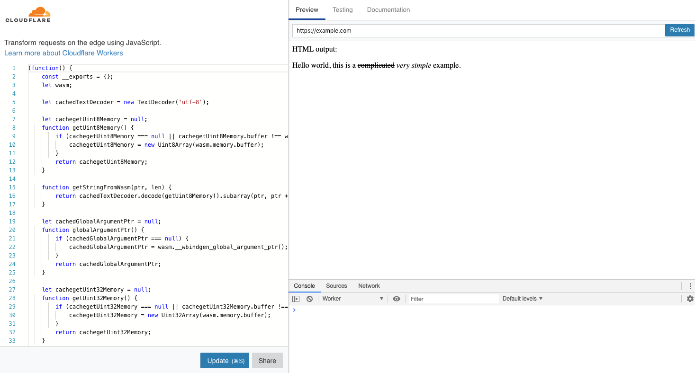

This tutorial will walk you through the steps of generating, building, previewing, configuring, and publishing
a Rust-generated WebAssembly Cloudflare Worker that parses Markdown. Let's get started!

This tutorial makes use of [Wrangler](https://github.com/cloudflare/wrangler), our command-line tool for generating, building, and publishing projects on the Cloudflare Workers platform. If you haven't used Wrangler, we recommend checking out the ["Installing the CLI"](/quickstart/cli-setup) part of our [Quick Start guide](/quickstart), which will get you set up with Wrangler, and familiar with the basic commands.

## Generate

Cloudflare's command-line tool for managing Worker projects, Wrangler, has great support for templates – pre-built collections of code that make it easy to get started writing Workers. We'll make use of the [rustwasm-worker template](https://github.com/cloudflare/rustwasm-worker-template/) to start building your project.

In the command line, generate your Worker project by passing in a project name (we'll use rustwasm-markdown-parser), and the template URL to base your project on.

```sh
wrangler generate rustwasm-markdown-parser https://github.com/cloudflare/rustwasm-worker-template/
```

This creates a directory called `rustwasm-markdown-parser` which you can now `cd` into.

Wrangler templates are just Git repositories, so if you want to create your own templates, or use one from our [Template Gallery](/templates), there's a ton of options to help you get started.

## Workers Playground

At the moment, it's not yet possible to run your Cloudflare Worker locally on your machine, but we do offer a hosted
preview - and you don't need to have a Cloudflare user account to use it! To run the preview, use the
`preview` command:

```sh
wrangler preview
```

Using the preview command will open a browser window with your Cloudflare Worker loaded in the Cloudflare preview
UI. Assuming everything went well, it should look like this:


## Building

Let's make our Worker more interesting. We'll pull in a dependency from the `crates.io` ecosystem called `pulldown-cmark`.
We'll add this to our `Cargo.toml`:

```toml
## Cargo.toml

[dependencies]
pulldown-cmark = "0.4.0"
```

Now we'll leverage the code in the `string-to-string` example from the `pulldown-cmark` GitHub repository. Let's change
our `src/lib.rs` to look like this:

```rust
// src/lib.rs

mod utils;

use cfg_if::cfg_if;
use wasm_bindgen::prelude::*;
use pulldown_cmark::{Parser, Options, html};

cfg_if! {
    // When the `wee_alloc` feature is enabled, use `wee_alloc` as the global
    // allocator.
    if #[cfg(feature = "wee_alloc")] {
        extern crate wee_alloc;
        #[global_allocator]
        static ALLOC: wee_alloc::WeeAlloc = wee_alloc::WeeAlloc::INIT;
    }
}

#[wasm_bindgen]
pub fn parse() -> String {
    let markdown_input: &str = "Hello world, this is a ~~complicated~~ *very simple* example.";
    println!("Parsing the following markdown string:\n{}", markdown_input);

    // Set up options and parser. Strikethroughs are not part of the CommonMark standard
    // and we therefore must enable it explicitly.
    let mut options = Options::empty();
    options.insert(Options::ENABLE_STRIKETHROUGH);
    let parser = Parser::new_ext(markdown_input, options);

    // Write to String buffer.
    let mut html_output: String = String::with_capacity(markdown_input.len() * 3 / 2);
    html::push_html(&mut html_output, parser);

    // Check that the output is what we expected.
    let expected_html: &str = "<p>Hello world, this is a <del>complicated</del> <em>very simple</em> example.</p>\n";
    assert_eq!(expected_html, &html_output);

    format!("\nHTML output:\n{}", &html_output)
}
```

Now we'll update our `worker/worker.js` to use the new code we've written:

```javascript
addEventListener('fetch', event => {
  event.respondWith(handleRequest(event.request))
})

/**
 * Fetch and log a request
 * @param {Request} request
 */
async function handleRequest(request) {
    const { parse } = wasm_bindgen;
    await wasm_bindgen(wasm)
    const output = parse()
    let res = new Response(output, {status: 200})
    res.headers.set("Content-type", "text/html")
    return res
}
```

Whenever we `preview` or `publish`, `wrangler` will build our project. But if you just want to `build` and not
`preview` or `publish`, you can run the `build` command:

```sh
wrangler build
```

This will compile your Rust to WebAssembly. It'll show you any compiler errors you have so you can fix them!
To preview this code in the Cloudflare UI, you can run:

```sh
wrangler preview
```

If everything worked, you should see:



## Publish

And with that, you're finished writing a Rust-generated WASM Cloudflare Worker!

Wrangler has built-in support for bundling, uploading, and releasing your Cloudflare Workers application. To do this, we'll run `wrangler publish`, which will _build_ and _publish_ your code:


## Resources

In this tutorial, you built and published a Rust-generated WebAssembly Worker that parses Markdown. If you'd like to see the full source code for this application, you can find it [on GitHub](https://github.com/granjef3/rustwasm-markdown-parser).

If you enjoyed this tutorial, we encourage you to explore our other tutorials for building on Cloudflare Workers:

- [Build A Serverless Function](/tutorials/build-a-serverless-function)
- [Build An Application](/tutorials/build-an-application)
- [Configure Your CDN](/tutorials/configure-your-cdn)

If you want to get started building your own projects, check out the quick-start templates we've provided in our [Template Gallery](/templates).
