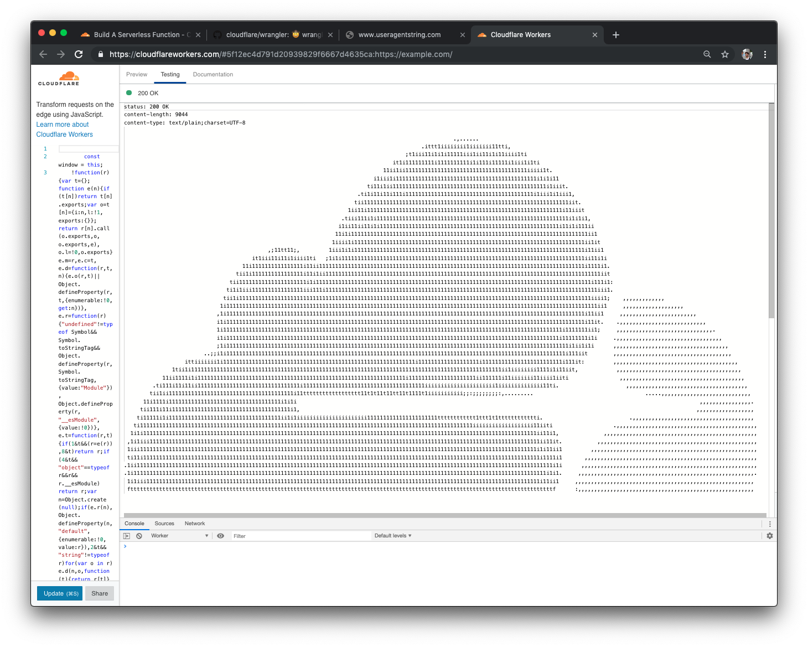
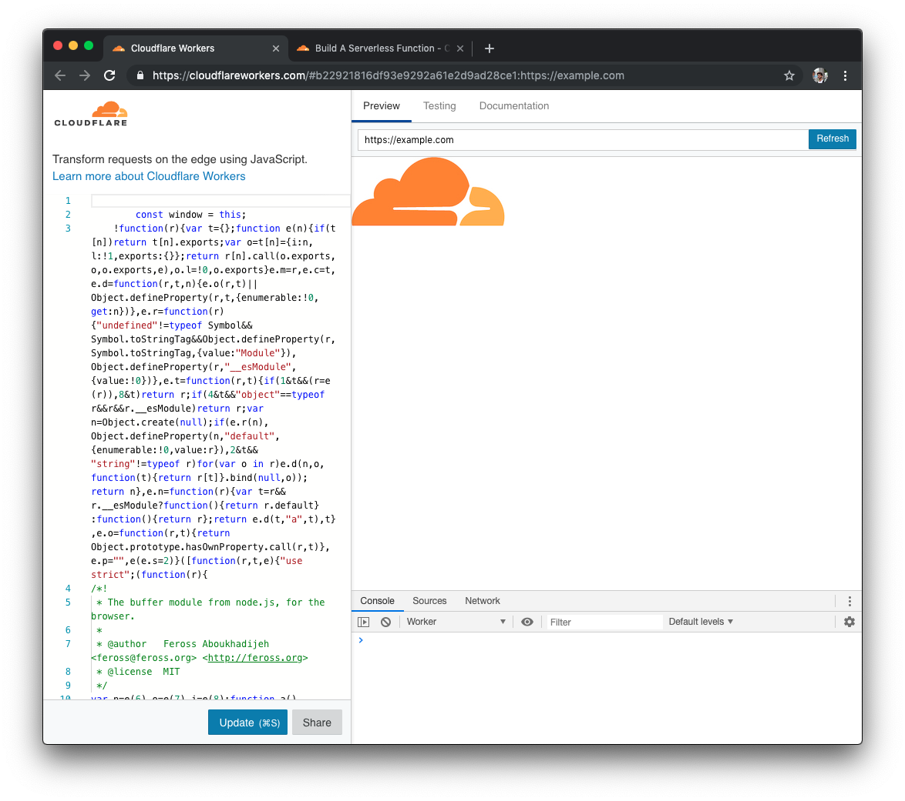
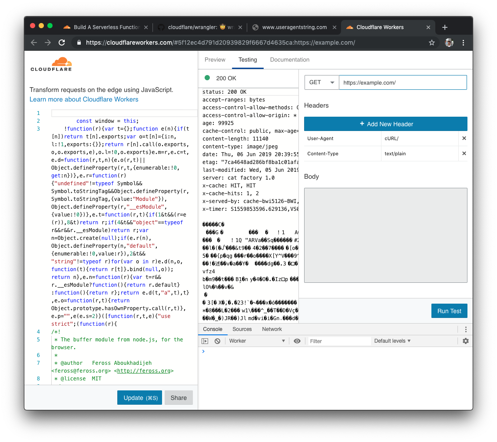

In this tutorial, you'll build and publish a serverless function that serves an image to browsers, but an ASCII image to terminal based HTTP clients like cURL.



This tutorial makes use of [Wrangler](https://github.com/cloudflare/wrangler), our command-line tool for generating, building, and publishing projects on the Cloudflare Workers platform. If you haven't used Wrangler, we recommend checking out the ["Installing the CLI"](/quickstart/cli-setup) part of our [Quick Start guide](/quickstart), which will get you set up with Wrangler, and familiar with the basic commands.

If you're interested in building and publishing serverless functions, this is the guide for you! No prior experience with serverless functions or Cloudflare Workers is assumed.

One more thing before you start the tutorial: if you just want to jump straight to the code, we've made the final version of the codebase [available on GitHub](https://github.com/granjef3/workers-asciilogo). You can take that code, customize it, and deploy it for use in your own projects. Happy coding!

## Prerequisites

To publish your customized response function to Cloudflare Workers, you'll need a few things:

- A Cloudflare account, and access to the API keys for that account
- A Wrangler installation running locally on your machine, and access to the command-line

If you don't have those things quite yet, don't worry. We'll walk through each of them and make sure we're ready to go, before you start creating your application.

You'll need to get your Cloudflare API keys to deploy code to Cloudflare Workers: see ["Finding your Cloudflare API keys"](/quickstart/api-keys) for a brief guide on how to find them.

## Generate

Cloudflare's command-line tool for managing Worker projects, Wrangler, has great support for templates – pre-built collections of code that make it easy to get started writing Workers. We'll make use of the default JavaScript template to start building your project.

In the command line, generate your Worker project, using Wrangler's [worker-template](https://github.com/cloudflare/worker-template), and pass the project name `workers-asciilogo`:

```sh
wrangler generate workers-asciilogo
cd workers-asciilogo
```

Wrangler templates are just Git repositories, so if you want to create your own templates, or use one from our [Template Gallery](/templates), there's a ton of options to help you get started.

Cloudflare's `worker-template` includes support for building and deploying JavaScript-based projects. Inside of your new `workers-asciilogo` directory, `index.js` represents the entry-point to your Cloudflare Workers application.

All Cloudflare Workers applications start by listening for `fetch` events, which are fired when a client makes a request to a Workers route. When that request occurs, you can construct responses and return them to the user. This tutorial will walk you through understanding how the request/response pattern works, and how we can use it to build fully-featured applications.

```javascript
addEventListener('fetch', event => {
  event.respondWith(handleRequest(event.request))
})

/**
 * Fetch and log a request
 * @param {Request} request
 */
async function handleRequest(request) {
  return new Response('Hello worker!', { status: 200 })
}
```

In your default `index.js` file, we can see that request/response pattern in action. The `handleRequest` constructs a new `Response` with the body text "Hello worker", as well as an explicit status code of 200.

When a `fetch` event comes into the worker, the script uses `event.respondWith` to return that new response back to the client. This means that your Cloudflare Worker script will serve new responses directly from Cloudflare's cloud network: instead of continuing to the origin, where a standard server would accept requests, and return responses, Cloudflare Workers allows you to respond quickly and efficiently by constructing responses directly on the edge.

## Build

Any project you publish to Cloudflare Workers can make use of modern JS tooling like ES modules, NPM packages, and [async/await](https://developer.mozilla.org/en-US/docs/Web/JavaScript/Reference/Statements/async_function) functions to put together your application. In addition, simple serverless functions aren't the only thing you can publish on Cloudflare Workers: you can [build full applications](/tutorials/build-an-application) using the same tooling and process as what we'll be building today.

### Handling requests

Currently, our Workers function receives requests, and returns a simple response with the text "Hello worker!".

```javascript
async function handleRequest(request) {
  if (request.method === 'POST') {
    return new Response('Hello worker!', { status: 200 })
  }
}
```

Lets serve something more interesting, how about the cloudflare logo?

```javascript
async function handleRequest(request) {
  try {
    const imgRequest = new Request("https://i.imgur.com/wKRoWhj.jpg");
    return fetch(imgRequest);
  } catch (err) {
    return new Response("something broke :(" + JSON.stringify(err), { status: 500 });
  }
}
```

This is great and all, but what if our client supported only text, no images? Lets check the user agent of our request, and deliver an appropriate response.


```javascript
async function handleRequest(request) {
  try {
    const imgRequest = new Request("https://i.imgur.com/wKRoWhj.jpg");
    if (userAgent.match(/(curl|libcurl|HTTPie)\//i)) { //filter by user-agent
      return "Sorry, your client isn't supported :(";
    } else {
      return fetch(imgRequest);
    }
  } catch (err) {
    return new Response("something broke :(" + JSON.stringify(err), { status: 500 });
  }
}
```

This isn't a great experience for your text-based users however. What if we could convert the image to text, within our worker?

## Image Conversion in Workers

All projects deployed to Cloudflare Workers support NPM packages, which makes it incredibly easy to rapidly build out _a lot_ of functionality in your serverless functions. The [`asciiPixels`](https://github.com/mathiasvr/ascii-pixels) is a module that takes in a buffer of image data, and converts it to an ASCII art string. How do we get the raw image data you ask? Another NPM package,[`jpeg-js`](https://github.com/eugeneware/jpeg-js) which is a pure-javascript JPEG decoder that outputs a `Buffer`, which is what `ascii-pixels` needs as input.

In the command line, install and save `ascii-pixels` and `jpeg-js` to your package.json:

```sh
npm install --save ascii-pixels jpeg-js 
```

In `index.js`, require the `jpeg-js` package as the variable `jpeg`, and `ascii-pixels` as `asciiPixels`:

```javascript
const jpeg = require("jpeg-js");
const asciiPixels = require("ascii-pixels");
```

Now, add the library calls to our packages to perform the conversion in `handleRequest`:

```javascript
async function handleRequest(request) {
  try {
    const userAgent = request.headers.get("user-agent") || "";
    const imgRequest = new Request("https://i.imgur.com/wKRoWhj.jpg");
    if (
      userAgent.match(/(curl|libcurl|HTTPie)\//i) // only curl or similar
    ) {
      let response = await fetch(imgRequest);
      let buffer = await response.arrayBuffer();
      let imageData = jpeg.decode(buffer);
      let ascii = asciiPixels(imageData);

      return new Response(ascii, { status: 200 });
    } else {
      return fetch(imgRequest);
    }
  } catch (err) {
    return new Response("something broke :(" + JSON.stringify(err), { status: 500 });
  }
}
```

Thanks to the massive javascript ecosystem, that didn't require much code at all! Let's test out this serverless function.

## Testing with wrangler preview

Wrangler has built in support for previewing your worker on `cloudflareworkers.com` -- without an account! Try it out by running `wrangler preview` in your project directory, and your browser will open to the workers editor.



You can see the compiled and minified output from `wrangler` in the left pane, and the response from your workers function on the right. If you click the `testing` tab, you'll see an option to add a new header. Go ahead and add a `User-Agent` header set to `cURL/`



Go ahead and click `Run Test` and you'll see the cloudflare logo rendered as ASCII art! (You may have to zoom out or move the sidebars).


## Publish

And with that, you're finished writing a serverless function that customizes its response based on the client's `User-Agent`, all on Cloudflare Workers!

Wrangler has built-in support for bundling, uploading, and releasing your Cloudflare Workers application. To do this, we'll run `wrangler publish`, which will _build_ and _publish_ your code:


## Resources

In this tutorial, you built and published a serverless function to Cloudflare Workers that customizes its response based on the client's `User-Agent`. If you'd like to see the full source code for this application, you can find it [on GitHub](https://github.com/granjef3/workers-asciilogo).

If you enjoyed this tutorial, we encourage you to explore our other tutorials for building on Cloudflare Workers:

- [Build an Application](/tutorials/build-an-application)
- [Build a Serverless Function](/tutorials/build-a-serverless-function)
- [Configure Your CDN](/tutorials/configure-your-cdn)

If you want to get started building your own projects, check out the quick-start templates we've provided in our [Template Gallery](/templates).
